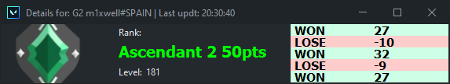
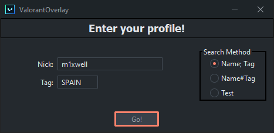

# ☕️ JValorantOverlay

**🌊 Swing-based Valorant frame that shows your latest stats**

Can be used to display your stats on a live stream or maybe to see other player's rank 👀.

## Usage

1. Download the .jar
2. Double click the .jar file
3. Fill the setup window and click done.

    

## Key Features

- Java based
- "Resizeable"
- Auto-updated

**Feedback is more than apreciated** although it should be taked into account that this is mainly a test/side project from my CS assigments on swing components.
Low effort code is expected and almost no OOP design patterns are applied.

This is was inspired by @RumbleMike and couldn't be done without @Henrik-3 simple Valorant API. Kudos to them.